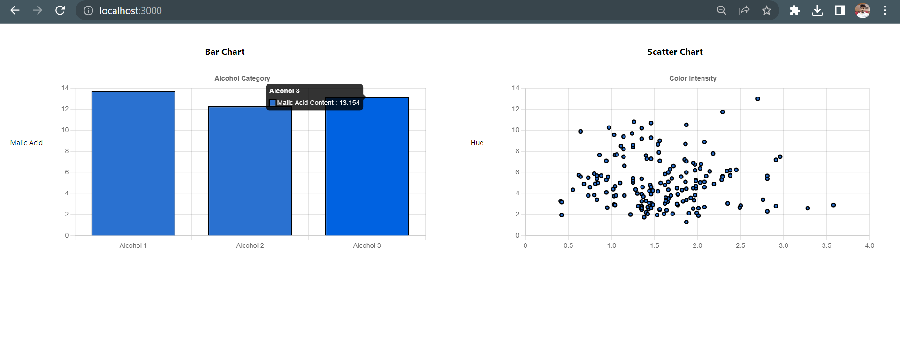
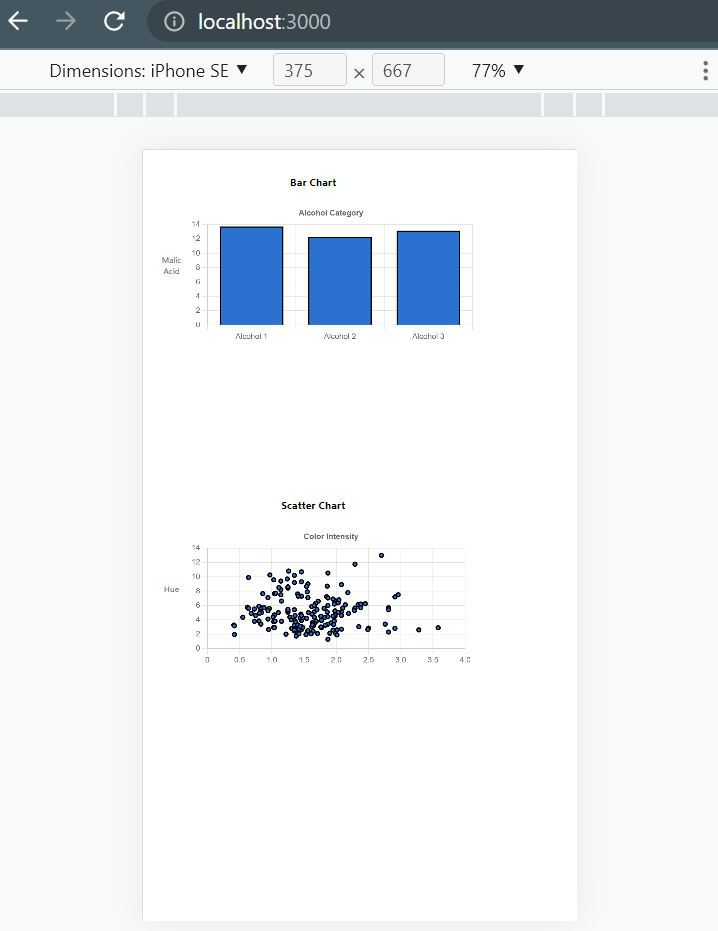
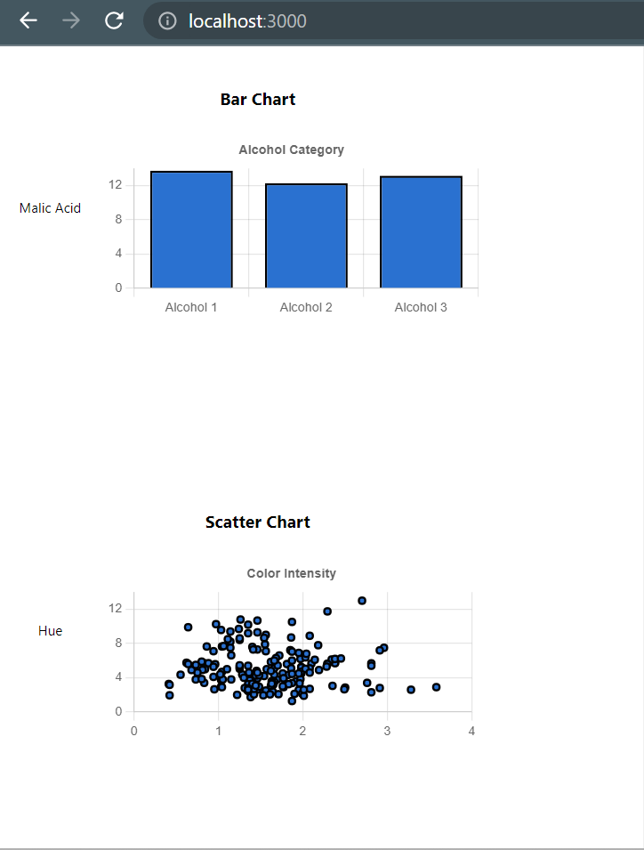

## Available Scripts

In the project directory, you can run:

### `yarn start`

Runs the app in the development mode.\
Open [http://localhost:3000](http://localhost:3000) to view it in your browser.

The page will reload when you make changes.\
You may also see any lint errors in the console.

### Commit Message Format
Each commit message consists of a simple patterns.  Below is the
format that includes a **type**, a **scope** and a **subject** and every Pull Request's commit should be squashed.

```
<type>(<scope>): <subject or your message>
```
## Commit Message Guidelines
Guidelines gives precise rules over how our git commit messages can be formatted.  This leads to **more
readable messages** that are easy to follow when looking through the **project history**.  But also,
we use the git commit messages to **generate the App change log**.

### Revert
If the commit reverts a previous commit, it should begin with `revert(<scope>): Your Message `, followed by the header of the reverted commit. In the body it should say: `This reverts commit <hash>.`, where the hash is the SHA of the commit being reverted.

### Type
Must be one of the following:

* **build**: Changes that affect the build system or external dependencies (example scopes: npm, rollup, webpack)
* **feature**: A new feature
* **fix**: A bug fix
* **perf**: A code change that improves performance
* **refactor**: A code change that neither fixes a bug nor adds a feature
* **tech**: Any Technical Activities.
* **style**: Changes that do not affect the meaning of the code (white-space, formatting, missing semi-colons, etc)
* **test**: Adding missing tests or correcting existing tests

For responsive images check public folder or click on below links


